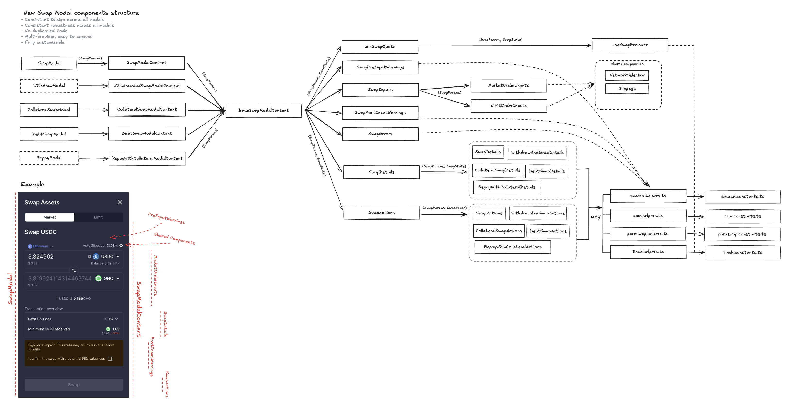

## Swap module

### Goals
- **Consistent UI/UX** across all swap-related modals
- **Shared logic, no duplication** via a common base content and shared helpers
- **Multi‑provider** architecture (CoW Protocol, ParaSwap; easy to extend)
- **Composable and customizable** components

### High‑level flow
1. A top‑level modal (`modals/*Modal.tsx`) renders a corresponding content component in `modals/request/*ModalContent.tsx`.
2. Each `*ModalContent` composes `BaseSwapModalContent`, which wires data, inputs, warnings, details, and actions.
3. Provider selection is automatic via `helpers/shared/provider.helpers.ts` (`getSwitchProvider`).
4. Quotes are fetched with `hooks/useSwapQuote` and refreshed periodically; flash‑loan and health‑factor logic is handled by `hooks/useFlowSelector`.
5. The UI is composed from shared inputs, pre/post warnings, per‑flow details, and provider‑specific actions.

### Directory overview
- `modals/`
  - Entry points displayed to users: `SwapModal.tsx`, `CollateralSwapModal.tsx`, `DebtSwapModal.tsx`, etc.
  - `modals/request/` contains `*ModalContent.tsx` for each flow and a `BaseSwapModalContent` used by all.
  - `modals/result/` shows success/receipt views.

- `inputs/`
  - `SwapInputs.tsx` orchestrates order inputs; `MarketOrderInputs.tsx` and `LimitOrderInputs.tsx` are the two modes.
  - `inputs/shared/` and `inputs/primitives/` host reusable input UI.

- `warnings/`
  - Pre‑ and post‑input warnings: `SwapPreInputWarnings.tsx`, `SwapPostInputWarnings.tsx`.
  - Flow‑ and rule‑specific implementations live under `warnings/preInputs/` and `warnings/postInputs/`.

- `details/`
  - Transaction overview blocks: `SwapDetails.tsx`, plus flow variants like `CollateralSwapDetails.tsx`, `DebtSwapDetails.tsx`, `RepayWithCollateralDetails.tsx`, `WithdrawAndSwapDetails.tsx`.
  - Provider‑specific cost breakdowns, e.g. `CowCostsDetails.tsx`.

- `actions/`
  - The submit/CTA area and transaction execution.
  - Flow containers: `SwapActions`, `CollateralSwapActions`, `DebtSwapActions`, `RepayWithCollateralActions`, `WithdrawAndSwapActions`.
  - Provider adapters implement the same surface per flow, e.g. `SwapActionsViaCoW.tsx`, `SwapActionsViaParaswap.tsx`, and their flow equivalents under each subfolder.
  - `approval/useSwapTokenApproval.ts` handles allowance flows when needed.

- `hooks/`
  - `useSwapQuote` retrieves and normalizes quotes (CoW/ParaSwap) and writes into `SwapState`.
  - `useFlowSelector` computes health‑factor effects and decides when to use flash‑loans.
  - Other utilities: `useSwapOrderAmounts`, `useSwapGasEstimation`, `useSlippageSelector`, `useMaxNativeAmount`, `useProtocolReserves`, `useUserContext`.

- `helpers/`
  - `shared/` contains provider‑agnostic logic (provider selection, formatting, misc) and `gasEstimation.helpers.ts`.
  - `cow/` and `paraswap/` contain provider integrations (rates, order helpers, misc).

- `errors/`
  - UI components and mapping/helpers for error presentation; organized by provider and shared concerns.

- `constants/`
  - Provider and feature flags: `cow.constants.ts`, `paraswap.constants.ts`, `limitOrders.constants.ts`, `shared.constants.ts`.

- `types/`
  - Shared domain types: params, state, tokens, quotes, and re‑exports.

- `shared/`
  - Small UI pieces reused across modals (e.g., `OrderTypeSelector`, `SwapModalTitle`).

- `analytics/`
  - Analytics constants and hooks to track swap interactions.

- `backup/`
  - Legacy/previous implementation kept for reference during the migration to the new modular structure.

### Extending to a new provider
1. Add provider constants in `constants/` and integration helpers under `helpers/<provider>/`.
2. Plug the provider into `helpers/shared/provider.helpers.ts` so it can be selected.
3. Implement `*ActionsVia<Provider>.tsx` for each supported flow under `actions/`.
4. Optionally add provider‑specific details/warnings and wire them in the `*Details.tsx`/warnings where appropriate.

### Data model
- `types/state.types.ts` defines the authoritative `SwapState` used across the module.
- `types/params.types.ts` carries immutable parameters from the modal entry.
- Quotes unify to a `quote.types.ts` shape so the UI remains provider‑agnostic.

### Notes
- `useSwapQuote` refreshes quotes every 30s by default, paused during action execution.
- Some flows invert the quote route (e.g., `DebtSwap`, `RepayWithCollateral`); this is encapsulated in `useSwapQuote` and consumers stay agnostic.

### Core types (documented)
- State: see `types/state.types.ts` (`SwapState`, `TokensSwapState`, `ProtocolSwapState`).
- Params: see `types/params.types.ts` (`SwapParams`).
- Tokens and quotes: see `types/tokens.types.ts`, `types/quote.types.ts`, and shared enums in `types/shared.types.ts`.

